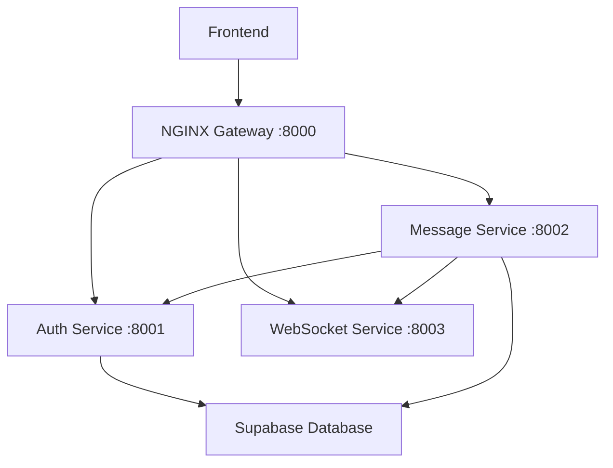

# 🏗️ LockBox Microservices Architecture

## 🎯 Architecture Overview

```
Frontend (Vercel) → NGINX API Gateway → Microservices → Database (Supabase)
                         (Port 8000)    ├── Auth Service (8001)
                                        ├── Message Service (8002)
                                        └── WebSocket Service (8003)
```

## 🚀 Quick Start

### **Prerequisites:**
- Python 3.8+
- NGINX installed (`brew install nginx` on macOS)
- All dependencies: `pip3 install fastapi uvicorn supabase bcrypt python-jose python-multipart python-dotenv websockets requests`

### **Start All Services:**
```bash
cd microservices
./start-services.sh
```

### **Stop All Services:**
```bash
./stop-services.sh
```

## 🔧 Services

### **🔐 Auth Service (Port 8001)**
- **Purpose:** User authentication, JWT tokens, user management
- **Endpoints:**
  - `POST /register` - User registration
  - `POST /login` - User login
  - `GET /verify/{token}` - Token verification
  - `GET /contacts/` - Get user contacts
  - `GET /users/search` - Search users
  - `POST /keys` - Store user keys

### **💬 Message Service (Port 8002)**
- **Purpose:** Message storage, encryption, chat requests
- **Endpoints:**
  - `POST /send` - Send encrypted message
  - `GET /` - Get user messages
  - `GET /conversation/{contact_id}` - Get conversation
  - `GET /chat-requests/incoming` - Get chat requests
  - `POST /chat-requests/send` - Send chat request

### **🔌 WebSocket Service (Port 8003)**
- **Purpose:** Real-time messaging, connection management
- **Endpoints:**
  - `WS /ws/{user_id}` - WebSocket connection
  - `POST /broadcast` - Broadcast message
  - `GET /connections` - Active connections

### **🌐 NGINX API Gateway (Port 8000)**
- **Purpose:** Load balancing, routing, CORS handling
- **Routes:**
  - `/auth/*` → Auth Service
  - `/messages/*` → Message Service
  - `/ws/*` → WebSocket Service
  - `/contacts/*` → Auth Service
  - `/chat-requests/*` → Message Service
  - `/users/*` → Auth Service

## 📊 Service Communication



## 🔍 Monitoring & Logs

### **Check Service Status:**
```bash
# Check if services are running
lsof -i :8000  # NGINX
lsof -i :8001  # Auth
lsof -i :8002  # Message
lsof -i :8003  # WebSocket
```

### **View Logs:**
```bash
tail -f logs/auth.log      # Auth service logs
tail -f logs/message.log   # Message service logs
tail -f logs/websocket.log # WebSocket service logs
```

### **Test Endpoints:**
```bash
# Health check
curl http://localhost:8000/health

# Test auth service
curl -X POST http://localhost:8000/auth/register \
  -H "Content-Type: application/json" \
  -d '{"username":"test","password":"test123"}'
```

## 🛠️ Development

### **Add New Service:**
1. Create new directory: `mkdir new-service`
2. Create `main.py` with FastAPI app
3. Add to `start-services.sh`
4. Update `nginx.conf` with routing
5. Add shared utilities import

### **Modify Existing Service:**
1. Edit service files directly
2. Restart services: `./stop-services.sh && ./start-services.sh`
3. Check logs for errors

## 🏆 Benefits Achieved

### **Scalability:**
- ✅ Scale each service independently
- ✅ Add more instances of busy services
- ✅ Horizontal scaling ready

### **Reliability:**
- ✅ Service isolation - one crash doesn't affect others
- ✅ Graceful degradation
- ✅ Health checks and monitoring

### **Development:**
- ✅ Team can work on different services
- ✅ Independent deployments
- ✅ Technology flexibility per service

### **Production Ready:**
- ✅ Load balancing with NGINX
- ✅ Service discovery
- ✅ Environment configuration
- ✅ Logging and monitoring

## 🎯 Resume Impact

**"Architected and implemented distributed microservices architecture using NGINX API Gateway, decomposing monolithic application into specialized services with service-to-service communication, load balancing, and independent scaling capabilities - demonstrating enterprise-level system design and DevOps practices"**

## 🚀 Next Steps

1. **Deploy to Cloud:** Use Docker containers on AWS ECS
2. **Add Monitoring:** Implement Prometheus/Grafana
3. **Service Discovery:** Add Consul or etcd
4. **Circuit Breakers:** Add resilience patterns
5. **API Versioning:** Implement versioned endpoints

---

**Built with enterprise-grade microservices architecture!** 🏗️✨